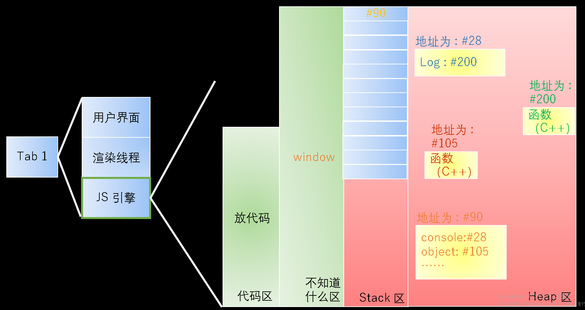

# 内存图

JS 代码下载之后，会被放到内存里面，但具体是放在内存里哪呢？

1. JS 引擎首先会把代码放到内存里；
2. 操作系统占的内存其实很小，大部分是被服务占据了。
3. 每个 Tab 有渲染线程、用户界面和 JS 引擎等。

> 🌴 JS 引擎除了右边的四个区之外，实际上还有**调用栈**、**任务队列**和**内存回收**等等。

## 不知道什么区

这里面存**环境**，包括**变量**。

比如我们 `var a = 1` ，那就会把 a 存在这，把 1 存在红色区域。

## Stack 栈区和 Heap 堆区

这两个区是用来专门存放**数据**的。

但并不存放变量名，`变量名`存在不知道什么区；

> ⚠️ 每种浏览器的分配规则是不一样的。

[JS 变量存储？栈 & 堆？NONONO!](https://juejin.cn/post/6844903997615128583)

### Skack 栈区

栈是内存中一块用于存储 `局部变量` 和 `函数参数` 的**线性**结构，遵循着 **先进后出（进电梯）**的原则。

每个数据按顺序存放，数据只能顺序的入栈，顺序的出栈。+

> 🌿 栈只是内存中一片连续区域一种形式化的描述，数据入栈和出栈的操作仅仅是栈指针在内存地址上的上下移动而已。

内存中栈区的数据，在函数调用结束后，就会自动的出栈，不需要程序进行操作，操作系统会自动执行，换句话说：**栈中的变量在函数调用结束后，就会消失。**

因此，栈的特点

- 轻量且不需要手动管理
- 函数调时创建，调用结束则消失

### Heap 堆区

堆可以简单地认为是一大块内存空间，就像一个篮子，你往里面放什么都没关系，但是篮子是私人物品，操作系统并不会管你的篮子里都放了什么，也不会主动去清理你的篮子，因此在 C 语言中，堆中内容是需要程序员手动清理的，不然就会出现内存溢出的情况。

为了一定程度的解决堆的问题，一些高级语言（如 Java，JavaScript）提出了一个概念：**GC**（Garbage Collection 即**垃圾回收**），用于协助程序管理内存，主动清理堆中已不被使用的数据。

既然堆是一个大大的篮子，那么在栈中存储不了的数据（比如一个对象），就会被存储在堆中，栈中就仅仅保留一个对该数据的引用（也就是该块数据的地址）。

Heap 堆区存进每一个数据都是随机放置的。

Heap 堆区里存的数据后来被下一个数据占住了怎么办呢？

在别的空间够的地方，开一个新的内存，把两个都存进去。之前的那个数据就不要了。空间够大就随便找个位置放，不够大，就把之前的删掉，重新找个位置存。

> 📌 因为都是随机的，所以也有可能下一个占住了之前存入数据的下面的位置，下不去了；
>
> 因为一般来说是从上到下的，一列占满了再另起一行。

## Stack 栈区和 Heap 堆区举例

JS 的所有数字都是 64 位的。

如果将对象存在 Stack 区里面，会很容易被别的对象占住了下面的位置，没法再去加东西了。

虽然也可以让下面的对象往下挪出位置，这也意味着我们一旦要加一个属性，就要让对象下面的都往后先挪出位置才行，所以**很低效**。

所以 person 存在 Heap 区里。

如果我们把 person2 的 name 改成了 x ，那 person 的 name 是会变成 x 呢，还是说依然是 nansen？

是 x 。

person2 和 person 用的是用一块内存。

这就是常说的，地址和值没区别。我们改了数据，它会去内存里面找地址#108，那地址为 #108的肯定都被修改了。

要是我改变了 Obj 的 toString ，那我新建的 Obj2 的 toString 是不是也改变了？

不会。你直觉觉得不会改变，JS 也不会去改变。

因为这种情况和上面的情况不一样，上面的只走一层，下面的要走两层。走两层的不能这样简单地修改。

所以即使我们将 `obj2.toString` 改成了 `xxx` ，但 `obj` 仍然是 `#103` ，是个函数。

**obj obj2 有什么相同点和区别？**

- 相同点：都可以调用 `.toString()`
- 区别：地址值不同；也可以拥有不一样的属性。

### 规律

1. 数据分两种：对象和非对象。
2. 对象：都放在 Heap 堆区。
    - 函数、数组都是对象。
3. 非对象：只要不是对象，都放在 Stake 栈区。
    - 只有数字、字符串、布尔不是对象。

> 看到代码，脑子里面就有内存图。

## 我还没写 JS 代码之前，我的内存长什么样子？

### 浏览器环境给 JS 提供了什么：

1. 提供了**全局对象 window** ；
2. **console 控制台** 挂在 window 上；
3. **document 文档** 挂在 window 上；
4. **Object 对象** 挂在 window 上；
5. **Array 数组** 是一种特殊的对象，也要挂在 window 上。 
6. **function 函数** 也是挂到 window 上的。
   
> `var a = [1,2,3]` 是 `var a = new Array(1,2,3)` 的简写。
> `var person = {}` 是 `var person = new object()` 的简写。
> `function f() {}` 是 `var f = new Function()` 的简写。

> 在我们写 JS 代码之前，至少得有上面的 5 个对象，他们都挂到 window 上面。 

> 🌿 简写和完整写法的区别？
>
> 两种作用是等价的。虽然大家都用的都是简写，但简写其实不太正规；完整写法更正规，不过没人用。

> 🌿 挂在 window 上，即 window 可以将他们 `.` 出来。
>
> window.console
> window.object

## 把 window 用内存画出来

实际的内存图

1. 所有的对象都挂在 window 上，所以 window 肯定是个变量。
   
    那 window 就要放在这个区，表示一个环境。
    
2. window 就存一个 #90 地址，除此之外它什么都不存。
3. 对象是没有名字的，它只有一个地址值，没有名字。
   
    有 console 这些名字，是因为有 window 把它们的地址存下来了，所以我们认为 console 这些是它们的名字。
    
    但其实它们之间都是通过一个地址值联系起来的。
    

## 另外一种画法：

抽象的内存图

1. 指向和引用的意思就是，保存了其地址值。
2. Object 是一个函数，也属于对象。

### 打出 Object 的结构

用一个特殊的 API ，`console.dir(window.Object)`

dir 的意思就是，打出它的结构。

（这个 API 只有在内存这里才会用到。）

我们可以看到，它虽然作为一个函数，但也有很多属性。

其中比较重要的属性有 `keys assign prototype` 等。

> 📌 一般来说，一个对象的首字母是大写的，那它就有 prototype 属性。

用 `new Array()` 或者 `[]` 可以产生一个新的数组。如果不用这两个，就产生不了一个数组。

我们也可以用和对象一样的方法，

### 细节

1. window 变量 和 window 对象是不同的两个东西，没有什么关系。
   
    window 变量保存在不知道什么区，window 对象保存在 Heap 区，只不过 window 变量里面恰巧存的是 window 对象的地址值。
    
2. 变量一般是一个容器，它可以存不同的地址值。
3. window 对象是 Heap 区里面的一坨数据，仅此而已。
   
    比如，我们可以 var x = window ，之后 x 就指向 window 对象。然后就得用 x.console x.Object 等了，而不能再用 window.console 。但一般不用这样改 window 。
    
    JQuery 也是一个挂到 window 上的函数，但我们平时一般会 var $ = JQuery ，因为 $ 更好打。
    
4. 同理，console 和 console 对象不是同一个东西。
   
    前者是内存地址值，后者是一坨内存。 
    
5. Object 和 Object 函数对象不是同一个东西。
   
    Object 是一个变量，Object 对象是一坨内存。
    
6. console 不是变量，是 window 存的两个属性。
7. 属性和对象也是两个完全不同的东西。存在 window 对象里面的 console 属性只是一个地址值。

> 📌 变量和对象没什么关系，属性和对象也没什么关系。