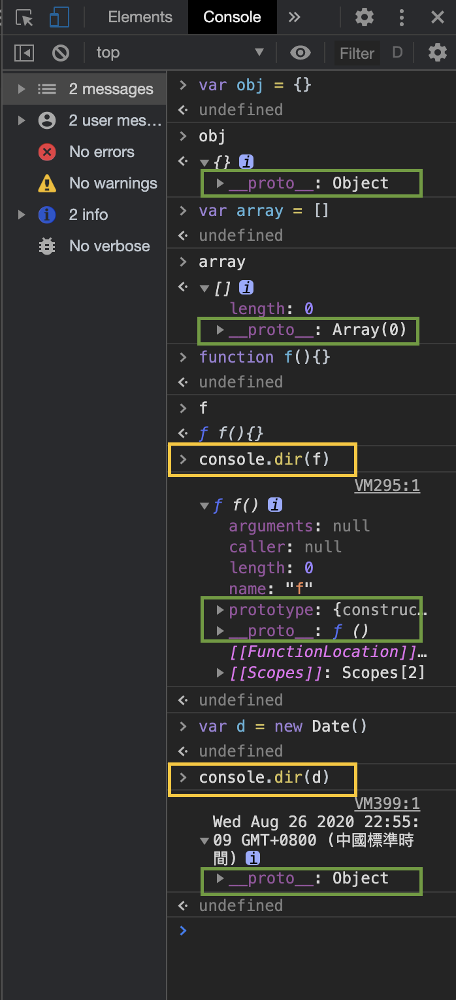
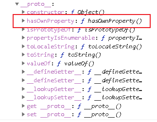

- [JavaScript 原型链](#javascript-原型链)
  - [图里的 prototype 是用来干什么的？](#图里的-prototype-是用来干什么的)
  - [现在来用一个简单的例子告诉你到底有什么用。](#现在来用一个简单的例子告诉你到底有什么用)
  - [总结](#总结)
  - [XXX.prototype 存储了各个 XXX 对象的共同属性，这就是原型](#xxxprototype-存储了各个-xxx-对象的共同属性这就是原型)
  - [_proto_ 就是我们之前没告诉名字的隐藏属性 xxx 。](#proto-就是我们之前没告诉名字的隐藏属性-xxx-)
    - [prototype 和 `__proto__` 的异同？](#prototype-和-__proto__-的异同)

# JavaScript 原型链

## 图里的 prototype 是用来干什么的？

Object 里的 prototype 只是一个属性而已，它真正对应的是一个对象。

这个对象可以这样拿出来看看，长这个样子：


prototype 里的这些函数看起来毫无用处

## 现在来用一个简单的例子告诉你到底有什么用。

**我们输入下面代码，为什么不报错呢？**

```bash
var obj = {}
obj.toString()
```

因为 obj 作为一个空对象，根本没有 toString 属性，怎么它还执行 obj.toString() 了呢？


**我们可以在控制台中打出 prototype 的全部属性**

```bash
console.dir(window.Object.prototype)
```

1. 隐藏属性是你看不见的属性。
2. 隐藏属性里存的地址值为什么是 `#409` 呢？
   
    因为生成的是一个对象，对象存的就是 Object 对应的 prototype 的地址值 `#409` 。
    
    只要生成的是对象，它就会存 Object 里的 prototype 的地址值。
    
    `obj.toString()` 发现 obj 上没有 toString ，就回去隐藏属性 xxx 对应的对象里面去找，即去 `Object.prototype` ，于是就找到了里面的 toString 。
    


```javascript
obj.toString === window.Object.prototype.toString
// true
```

可以看出这两就是等价的。

所以才不会报错。

**那如果我们又加了一个数组：**

这个新建的数组又存了 Array 里的 prototype 的地址值。

```javascript
var a [1,2,3]
```

再在数组里面加一个 4

```javascript
a push(4)
```


```javascript
arr.push === window.Array.prototype.push
// true
```

可以看出这两就是等价的。

所以也不会报错。

## 总结

在还没写 JS 代码的时候，就已经在内存里存了 Object 里 prototype 对应的对象和 Array 里 prototype 对应的对象。

这两个对象放在内存里，就是用来给我们创建对象的时候引的。当我们来创建一个普通对象，它就会去引。

用的是隐藏属性去引。

## XXX.prototype 存储了各个 XXX 对象的共同属性，这就是原型

如果两个对象有共同的属性，就把同样的属性放到隐藏属性里边，这样就不用重复地写这些属性了。

**如果没有这个原型呢？**

```javascript
var obj = {
  toString: window.Object.prototype.toString,
  hasOwnPropertyOf: window.Object.prototype.hasOwnPropertyOf,
}
obj.toString()

var obj2 = {
  toString: window.Object.prototype.toString,
  hasOwnPropertyOf: window.Object.prototype.hasOwnPropertyOf,
}
obj2.toString()

obj3 ... ...
obj4 ... ...
... ...

// 这样大家都要把原型里提供了的方法重新写一遍
```

> 每个对象都有一个隐藏属性，指向跟其他对象的共有属性。 

**共有属性就叫原型。**

原型让你无需重复声明共有属性，省代码省内存。



从上图可以看出所有对象都是有隐藏属性的。

黄框的，是因为它们要用 `console.dir` 才能将它的结构弄出来。

甚至 Object 也有隐藏属性。

> 📌 首字母大写的对象，只用关心它里面有 prototype ，不用管它的隐藏属性；
> 我们只关心首字母小写的对象的隐藏属性。

## _proto_ 就是我们之前没告诉名字的隐藏属性 xxx 。

除了隐藏属性，灰掉的属性因为是不可枚举属性，所以也是灰掉的。

### prototype 和 `__proto__` 的异同？

- 都存放着原型的地址；
- 不过前者是挂在函数（即首字母大写的对象。一般首字母大写的都是函数）上，后者是挂在每个新建的对象（即首字母小写的对象）上。

> 如果我们尝试去篡改共有属性，会发现是改不了的。
因为改的时候，我们是得不到共有属性的；
只有在读的时候，会得到共有属性。

如果调用的是 `arr.hasOwnProperty` ，

而这个 hasOwnProperty 在 Object 里的 prototype 里放着。

**请问它是怎么拿到这个 hasOwnProperty 的呢？**

因为函数也是对象，所以在在 arr 里面有一个隐藏属性 '__proto__' ，它指向的是 Object 的 prototype 的对象。

而在 Object 的 prototype 的对象里面也有一个隐藏属性 '__proto__'，它没有上一层了，它的值是空。

下图是 console.dir(Array.prototype) 打出来的。

