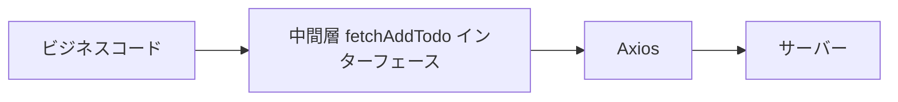

# フロントエンド単体テスト勉強会 - 第二回

## バックドア操作によるテストデータの準備

### バックドア操作とは

バックドア操作とは、非公開の API を呼び出してテストデータを準備することを指します。

例えば、Todo プロジェクトで `removeTodo` 機能（`id` で `todo` を削除）が正常に動作するかをテストしたいとします。

しかし、まだ `addTodo` 関数を実装していない場合があります。

この時、`todos` に直接 `todo` を `push` してテストを行うことができます。

```js
const todo = {
  id: 0,
  title: "work",
};

store.todos.push(todo);
```

これがバックドア操作によるテストデータの準備です。

この操作方法はビジネスコードの実装と非常に密接に結びついています。

例えば、上記のコードは **`todo` のデータ構造を露呈しています**。

後に `todo` に属性が追加されると、このテストコードもエラーを引き起こす可能性があります。

### 脆弱なテスト

このようなテストは脆弱なテストです。

このようなテストが増えると、みんながビジネスコードを変更することを恐れるようになります。

しかし、ここではまだ `addTodo` が実装されていないので、まずは一時的にバックドア操作を使用して `removeTodo` をテストすることもできます。

その後、`addTodo` 機能が実装されたら、バックドア操作を置き換える必要があります。

可能な限りバックドア操作を使用せず、**round-trip** 方法を優先してください。

> round-trip とは、ソフトウェアテストにおいて、特定の機能やプロセスが開始点から終了点まで、そして元の開始点に戻るまでの全プロセスを通してテストするアプローチを指します。

## プログラムの間接入力

### 直接入力とは

これは、ビジネスコード内の関数が引数を通じて直接データを受け取り、計算を行うことを指します。

関数を呼び出し、引数を渡すだけで、これが直接入力の方法です。

```ts
function add(a: number, b: number): number {
  return a + b;
}
```

### 間接入力とは

以下のコードのように、他のモジュール/関数/グローバルオブジェクトなどを通じて、引数以外の方法でデータを入力することを間接入力と呼びます。

```ts
export function doubleUserAge(): number {
  // userAge を通じてデータを取得
  return userAge() * 2;
}
```

間接入力が特別な処理を必要とする理由：

```ts
function userAge() {
  return 23;
}
```

`userAge` は API のリクエストや `store` のデータ読み取りを通じて取得される可能性があります。

つまり、`age` は変更される可能性が高い値です。

```ts
const doubleAge = doubleUserAge();

expect(doubleAge).toBe(48);
```

直接入力のように固定してしまうと、`age` が更新されるたびにテストをメンテナンスする必要があります。

このようなテストは脆弱なテストです。

よく考えてみると、実際にテストしたいのは \* 2 というロジックです。

`age` の値がいくつであるかは、実は重要ではありません。

`userAge` の値をコントロールする必要があります。

### mock と stub

#### stub とは何か

stub とは、実際のロジック実装を置き換えるテスト用語です。

stub を使用することで、テストは外部の実際のコード実装から分離され、テストロジックがよりシンプルで理解しやすくなります。

#### mock と stub の違い

単体テストにおいて：

1. stub は間接入力を制御する方法であり、間接入力の実際の実装を置き換えます。

   stub は単に値を返すだけです。

   ```js
   // stub
   vi.mock("packageName", () => {
     return {
       functionName: () => 2,
     };
   });
   ```

2. mock はテストの代用品を指します。

   mock はテストの代用品として、行動検証に必要な相互作用情報を記録するだけでなく、検証も提供します。

   mock は stub に比べて、相互作用情報の記録と検証機能が追加されています。

   mock は stub の基礎に加えて、相互作用情報を記録します。

   ```js
   // mock
   vi.mock("packageName", () => {
     return {
       functionName: vi.fn(() => 2),
     };
   });
   ```

### 最小準備データ原則

データを準備する際には、その単体テストケースで必要とされるデータのみを提供します。

データが少ないほど、テストケースは読みやすくなります。
この原則に違反すると、コードの保守性と可読性が低下し、心理的な負担が増えます。

単体テストはビジネスコードのユーザーの一つです。

したがって、単体テストはビジネスコードをより良く書くためのドライバーになり得ます。

単体テスト自体は、簡潔さと可読性を重視しています。

単体テストもコードの一部であり、保守が必要です。

もしテストコードの保守にビジネスコードの保守よりも多くの時間がかかるなら、あなたはまだテストを書きますか？

## 他のされモジュールからエクスポートた関数に依存する

`vi.mocked().mockReturnValue()`

`vi.mock()` は `path` のみを受け取り、その後に `mock` を行います。

```ts
import { userAge } from "./user";

vi.mock("./user");

describe("間接入力の値を制御する", () => {
  it("* 2", () => {
    vi.mocked(userAge).mockReturnValue(2);

    const r = doubleUserAge();
    expect(r).toBe(4);
  });
});
```

この方法では、異なるテストケースで異なる値を mock することができます。

## 第三者ライブラリへの依存

例えば Axios のような第三者モジュールを呼び出す場合、どのようにテストすればいいのでしょうか？

第三者ライブラリ/モジュールの関数を mock することは、自分たちが書いた関数を mock するのと同じです。

唯一の違いは、**パス**を**モジュール名**に変更することです。

```ts
vi.mock("axios");

it("第三者ライブラリ/モジュール: Axios", async () => {
  vi.mocked(axios).mockResolveValue({ name: "nansen", age: 2 });

  const r = await doubleUserAge();
  expect(r).toBe(4);
});
```

## 定数による間接入力

例えば、以下のコードでは、`tellName` 関数が定数 `name` を使用しています。

```ts
// config.ts

export const config = {
  allowTellAge: true,
  age: 18,
  getAge() {
    return 18;
  },
};

export const name = "nansen";
export const gold = 3;
```

```ts
// tellName.ts

import { name } from "./config";

export function tellName() {
  return name;
}
```

config.ts からエクスポートされた内容を直接 mock することができます。

```ts
// tellName.spec.ts

import { tellName } from "./tellName";

vi.mock("./config", () => {
  return {
    name: "n",
  };
});

describe("定数による間接入力", () => {
  it("should tell the name", () => {
    const name = tellName();
    expect(name).toBe("n");
  });
});
```

注意点として、上記の方法で mock すると、`config.ts` の全てのエクスポート内容が変更されます。

つまり、元々 `gold` や `config` もエクスポートされていましたが、mock した後は存在しなくなり、`name` のみが残ります。

この場合、パラメータ `importOriginal` と API `vi.importActual` を使用して、他のエクスポートされた内容を取得できます。

1. `importOriginal`

   ```ts
   // tellName.spec.ts

   import { tellName } from "./tellName";

   vi.mock("./config", async (importOriginal) => {
     const config = await importOriginal();

     return {
       ...config,
       name: "n",
     };
   });

   describe("定数による間接入力", () => {
     it("should tell the name", () => {
       const name = tellName();
       expect(name).toBe("n");
     });
   });
   ```

2. `vi.importActual`

   ```ts
   // tellName.spec.ts

   import { tellName } from "./tellName";

   vi.mock("./config", async () => {
     const config = await vi.importActual("./config");

     return {
       ...config,
       name: "n",
     };
   });

   describe("定数による間接入力", () => {
     it("should tell the name", () => {
       const name = tellName();
       expect(name).toBe("n");
     });
   });
   ```

パラメータ `importOriginal` を使用することを推奨します。

なぜなら、パスを再度記述する必要がなく、コードがよりクリーンになるからです。

## 環境変数による間接入力

以下の二つの方法で環境変数を取得できます。

```js
// Node.js 環境下

process.env;
```

```js
// Vite, Webpack などのバンドラー環境下

import.meta.env;
```

環境変数を使用した機能については、環境変数の値を直接変更してテストを行うことができます。

```ts
it("process.env", () => {
  process.env.USER_AGE = 2;

  const r = doubleUserAge();

  expect(r).toBe(4);
});
```

しかし、環境変数を元の値に戻したい場合は、`vi.stubEnv(env, val)` を使用して環境変数を変更し、`vi.unstubAllEnvs()` で環境変数を復元できます。

```ts
it("vi.stubEnv", () => {
  vi.stubEnv("USER_AGE", 2);

  const r = doubleUserAge();

  expect(r).toBe(4);
});

afterEach(() => {
  vi.unstubAllEnvs();
});
```

`vi.unstubAllEnvs()` は通常 `afterEach` と一緒に使用されます。

## グローバル変数による間接入力

グローバル変数による間接入力には通常、二つのシナリオがあります。

`window.innerHeight` などのグローバル変数の使用；

第三者ライブラリなどが提供するグローバル変数の使用。

たとえば、現在第三者ライブラリがグローバルに `user` オブジェクトを提供しており、そのオブジェクトには `age` プロパティがあります。

この場合、`vi.stubGlobal(name, val)` を使用してそのグローバル変数を mock することができます。

```ts
it("double user age", () => {
  vi.stubGlobal("user", {
    age: 2,
  });

  const r = doubleUserAge();

  expect(r).toBe(4);
});
```

`window.innerHeight` のようなグローバル変数の mock も同様の方法で行います。

```ts
it("double innerHeight", () => {
  vi.stubGlobal("innerHeight", 100);

  const r = doubleInnerHeight();

  expect(r).toBe(200);
});
```

`vi.unstubAllGlobals` でグローバル変数を復元できます。

## 間接層処理のテクニック

> ❗ 一層の間接層で解決できない問題はない。もし存在するなら、もう一層追加すればいい。

このテクニックは非常に強力で、すべての間接入力を処理する方法を、関数やオブジェクトの形で扱うことに変換できます。

また、複雑なテストやビジネスコードを単純化するためにもこのテクニックを使用できます。

例えば、以下のようなコードがあります：

```ts
// doubleHeight.ts

export function doubleHeight() {
  return innerHeight * 2;
}
```

```ts
// doubleHeight.spec.ts

it("double innerHeight", () => {
  vi.stubGlobal("innerHeight", 100);

  const r = doubleHeight();

  expect(r).toBe(200);
});
```

直接グローバル変数を操作したくない場合、間に一層の中間層を加えて処理することができます：

```ts
// doubleHeight.ts

import { innerHeightFn } from "./window";

export function doubleHeight() {
  return innerHeightFn() * 2;
}
```

```ts
// window.ts

export function innerHeightFn() {
  return innerHeight;
}
```

```ts
// doubleHeight.spec.ts

vi.mock("./window.ts", () => {
  return {
    innerHeightFn: () => 100,
  };
});

it("double innerHeight", () => {
  const r = doubleHeight();

  expect(r).toBe(200);
});
```

## API のテスト方法

以下のサンプルコードを用いて、API をテストするための方法を紹介します。

```ts
export function fetchAddTodo(title: string) {
  return axios.post("/api/addTodo", { title }).then(({ data }) => {
    return data;
  });
}
```

上のコードには 4 つの層があります：



最も外側の層はビジネスコードです、

中間層は `fetchAddTodo` インターフェースです、

`fetchAddTodo` インターフェースは Axios を使用して API にリクエストを送ります、

最も内側の層は、最終的にブラウザからサーバーに送られるリクエストです。

### 中間層を mock する

```ts
vi.mock('./todo')

test("add todo", () => {
vi.mocked(fetchAddTodo).mockImplementation(title) => {
  return Promise.resolve({
    data: { data: { id: 1, title } },
    state: 1,
  });
};

setActivePinia(createPinia());

const todoStore = useTodoStore();
const title = "eat";

await todoStore.addTodo(title);

expect(todoStore.todo[0].title).toBe(title);
})
```

この方法は `fetchAddTodo` インターフェースを露出していますが、これらのインターフェースは非常に安定しています。

したがって、axios を mock するよりも中間層を mock する方が良く、最も推奨される API テストの方法です。

> 直接 axios を mock する実装方法の欠点は、実装の詳細（axios）が露出することです。
>
> もしいつか axios が別の方法に置き換えられた場合、これらのテストもすべて置き換える必要があります。
