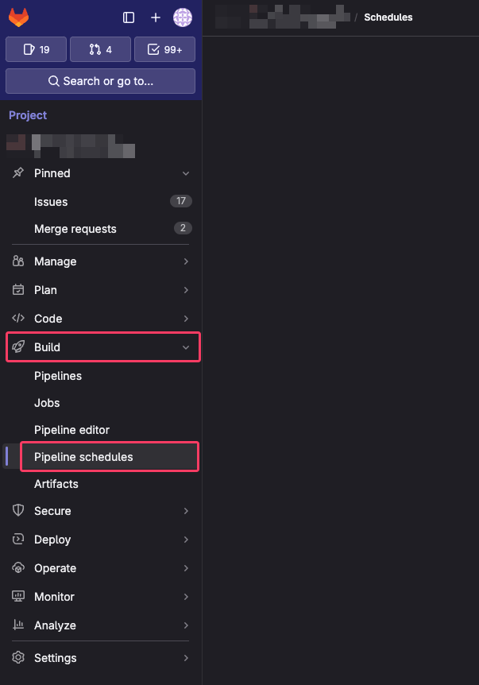

# 基本的な GitLab CI/CD 設定を紹介します！

## `.gitlab-ci.yml`

```yaml
stages:
  - test
  - build

default:
  image: node:lts
  cache:
    key:
      files:
        - package.json
    paths:
      - node_modules/
      - package-lock.json

before_script:
  - npm ci

unit_test_job:
  stage: test
  variables:
    TZ: "Asia/Tokyo"
  script:
    - npm run test-ut
  tags:
    - dragonfly
    - frontend

component_test_job:
  image: mcr.microsoft.com/playwright:v1.43.0-jammy
  stage: test
  variables:
    TZ: "Asia/Tokyo"
  before_script:
    - apt-get update && apt-get install -y python3 python3-pip
    - npm ci
  script:
    - npm run test-ct
  tags:
    - dragonfly
    - frontend

build_job:
  stage: build
  script:
    - npm run build
  tags:
    - dragonfly
    - frontend
```

この `.gitlab-ci.yml` のコードは、GitLab CI/CD のパイプラインを設定しています。

まず、2 つのステージ、`test` と `build` を定義しています。

デフォルト設定では、`node:lts` イメージを使用し、`package.json` と `node_modules/`、`package-lock.json` をキャッシュしています。

`before_script` では、`node_modules` ディレクトリが存在しない場合に `npm ci` を実行します。

`unit_test_job` では、`test` ステージで `npm run test-ut` を実行します。
`component_test_job` では、`test` ステージで `npm run test-ct` を実行します。
`build_job` では `build` ステージで `npm run build` を実行します。

> `component_test_job` では、playwright が提供してくれる `mcr.microsoft.com/playwright:v1.43.0-jammy` image を使っています。
>
> GitLab Runner にも `apt-get update && apt-get install -y python3 python3-pip` で　 Python をインストールしています。

各ジョブには `dragonfly` と `frontend` のタグが付いています。

これにより、コードの更新があるたびに自動的にテストとビルドが行われます。

## CI/CD Runner

プロジェクト専用の GitLab CI/CD Runner は以下のように設定されています。

```toml
# 同時に実行できるジョブの数を 1 に設定しています。
concurrent = 1
# Runner がジョブをチェックする間隔は特に設定されていません。
check_interval = 0
# Runner のシャットダウンタイムアウトは設定されていません。
shutdown_timeout = 0

[session_server]
  session_timeout = 1800 # セッションサーバーのタイムアウト時間を 1800 秒（30分）に設定しています。

[[runners]]
  name = "DragonFly-FE" # Runner の名前を「DragonFly-FE」に設定されています。
  url = "https://gitlab.firstloop-tech.com" # GitLab の URLが指定されています。
  # すべての CI/CD タスク（ビルドやテストなど）はこの GitLab インスタンスがあるサーバー環境で実行されます。
  id = 12 # Runner の ID が指定されています。
  token = "glrt-mk-3FfFyysbC7Pz3TUJs" # Runner の Token が指定されています。
  token_obtained_at = 2024-01-18T07:12:02Z
  token_expires_at = 0001-01-01T00:00:00Z
  executor = "docker" # Docker を実行環境として使用します。
  [runners.cache]
    MaxUploadedArchiveSize = 0 # キャッシュされたアーカイブの最大アップロードサイズに制限は設けられていません。
  [runners.docker]
    tls_verify = false # TLSの検証を行わない設定です。
    image = "node:lts" # 使用するDockerイメージとして「node:lts」が指定されています。
    pull_policy = ["if-not-present", "always"] # イメージのプルポリシーとして「存在しない場合と常にプルする」が設定されています。
    privileged = false # 特権モードは使用しない設定です。
    disable_entrypoint_overwrite = false # エントリポイントの上書きを禁止していません。
    oom_kill_disable = false # OutOfMemory Killerの無効化は行っていません。
    disable_cache = false # キャッシュの無効化は行っていません。
    volumes = ["/cache"] # キャッシュ用のボリュームとして「/cache」が設定されています。
    shm_size = 0 # 共有メモリサイズMTUの設定は特に行っていません。
    network_mtu = 0 # 共有ネットワークMTUの設定は特に行っていません。
```

## パイプラインスケジュール

GitLab のスケジュール機能は、定期的に CI/CD パイプラインを実行することができ、特定の時間や間隔でタスクを実行する必要がある場合、例えば夜間のビルド、定期的なデータバックアップ、定期的なテストに特に便利です。

現在の E2E テストは不安定で時間がかかるため、コード変更に基づくパイプラインではなく、定期的に実行するタスクに追加することを決めました。

これを行うには、まずパイプラインスケジュールを設定し、その後 `.gitlab_ci.yml` ファイルを設定する必要があります。

### パイプラインスケジュールの設定

### スケジュールの設定

- GitLab プロジェクトにアクセスする

- プロジェクトのサイドバーから Build の下にある Pipeline schedules を選択し、クリックして進む

  

- Pipeline Schedules 設定ページに移動したら、New Schedule ボタンをクリックして新しいスケジュールを作成する

- スケジュールの名前を設定する

- [Cron 式](https://ja.wikipedia.org/wiki/Cron)を入力する

  ```bash
  # ┌───────────── 分（0〜59）
  # │ ┌───────────── 時（0〜23）
  # │ │ ┌───────────── 日（1〜31）
  # │ │ │ ┌───────────── 月（1〜12）
  # │ │ │ │ ┌───────────── 曜日（0〜6〈日〜土〉、一部のシステムでは7も日曜日）
  # │ │ │ │ │
  # │ │ │ │ │
  # * * * * * [予約するコマンド]
  ```

- 対象ブランチを指定する

- 設定を保存する

### `.gitlab-ci.yml` の更新

GitLab CI では、スケジュールはパイプラインを最小単位として実行されます。

しかし、すべてのジョブが実行されるわけではなく、特定のジョブだけを実行したい場合は、`rules` フィールドを使用してジョブの実行タイミングを詳細に設定することができます。

```yaml
example_job:
  rules:
    - if: $CI_PIPELINE_SOURCE != "schedule"
```

`$CI_PIPELINE_SOURCE == "schedule"` を使用すると、このジョブがスケジュールによってトリガーされたパイプラインでのみ実行されるように設定できます。

`rules` フィールドには複数の `if` 条件を設定でき、1 つの `if` 条件が満たされればジョブが実行されます。

複数の条件をすべて満たす場合にのみジョブをトリガーするには、`&&` を使用して複数の条件を関連付ける必要があります。

```yaml
example_job:
  rules:
    - if: $CI_PIPELINE_SOURCE != "schedule" && $CI_COMMIT_BRANCH == "master"
```

> 注意：`only` と `except` フィールドも `rules` フィールドと同様にジョブの実行タイミングを設定できるため、1 つのジョブでこれらの設定を同時に使用することはできません。

### 更新された完全な `.gitlab-ci.yml` ファイル

```yaml
.install_dependencies: &install_dependencies
  before_script:
    - apt-get update && apt-get install -y python3 python3-pip zip
    - npm ci

.default_tags: &default_tags
  tags:
    - dragonfly
    - frontend

variables:
  SERVER_URL: http://localhost:3000
  PLAYWRIGHT_DOCKER_IMAGE: mcr.microsoft.com/playwright:v1.45.0-jammy
  TOKYO_TZ: Asia/Tokyo

stages:
  - test
  - build

default:
  image: node:lts
  cache:
    key:
      files:
        - package.json
    paths:
      - node_modules/
      - package-lock.json

unit_test_job:
  stage: test
  variables:
    TZ: $TOKYO_TZ
  script:
    - npm ci
    - npm run test-ut
  <<: *default_tags
  rules:
    - if: $CI_PIPELINE_SOURCE != "schedule"

e2e_test_job:
  image: $PLAYWRIGHT_DOCKER_IMAGE
  stage: test
  <<: [*install_dependencies, *default_tags]
  script:
    - npm run dev &
    - npx wait-on $SERVER_URL --timeout 30000
    - npm run e2e-test
  timeout: 30m
  rules:
    - if: $CI_PIPELINE_SOURCE == "schedule"

build_dev_job:
  stage: build
  <<: [*install_dependencies, *default_tags]
  artifacts:
    name: out_dev
    paths:
      - out_dev.zip
    expire_in: 1 week
  script:
    - npm run build:dev
    - zip -r out_dev.zip ./out
  rules:
    - if: $CI_PIPELINE_SOURCE != "schedule" && $CI_COMMIT_BRANCH == "develop"

build_prod_job:
  stage: build
  <<: [*install_dependencies, *default_tags]
  artifacts:
    name: out_prod
    paths:
      - out_prod.zip
    expire_in: 1 week
  script:
    - npm run build:prod
    - zip -r out_prod.zip ./out
  rules:
    - if: $CI_PIPELINE_SOURCE != "schedule" && $CI_COMMIT_BRANCH == "master"

build_other_job:
  stage: build
  <<: [*install_dependencies, *default_tags]
  script:
    - npm run build:dev
  rules:
    - if: $CI_PIPELINE_SOURCE != "schedule" && $CI_COMMIT_BRANCH != "master" && $CI_COMMIT_BRANCH != "develop"
```
