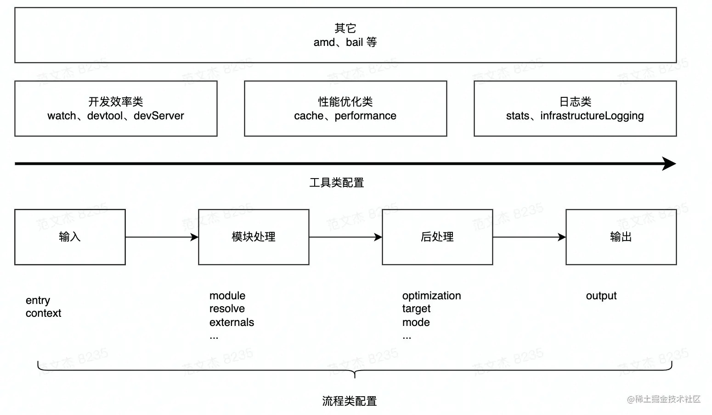

# 如何理解 Webpack 配置底层结构逻辑

- [如何理解 Webpack 配置底层结构逻辑](#如何理解-webpack-配置底层结构逻辑)
  - [结构化理解 Webpack 配置项](#结构化理解-webpack-配置项)
    - [Webpack 打包流程的四个阶段](#webpack-打包流程的四个阶段)
    - [两类 Webpack 配置项](#两类-webpack-配置项)
      - [流程类配置项](#流程类配置项)
      - [工具类配置项](#工具类配置项)
  - [配置逻辑综合解析](#配置逻辑综合解析)
    - [脚手架工具](#脚手架工具)
      - [Vue CLI](#vue-cli)
      - [CRA Create React Application](#cra-create-react-application)

Webpack 的功能虽然非常全面和强大，但代价则是日益复杂、晦涩的使用方法。
开发者通常需要根据项目环境、资源类型、编译目标编写一份复杂的配置文件，用以定制资源打包行为。
但仅 Webpack 原生配置项就多达上百种，且各项之间缺乏一致性与关联度，
对初学者而言单是掌握每一个配置的作用与变种就已经很难，更不用说理解配置与配置之间的协作关系。

## 结构化理解 Webpack 配置项

Webpack 原生提供了上百种配置项，这些配置最终都会作用于 Webpack 打包过程的某个/几个阶段。

所以我们可以从流程角度，更框架性、结构化地，了解各项配置的作用。

### Webpack 打包流程的四个阶段

Webpack 的打包流程虽然非常复杂，但大致可简化分为以下四个阶段：

1. **输入**
   从文件系统读入代码文件；

2. **模块递归处理**
   调用 Loader 转译 Module 内容，
   并将结果转换为 AST，
   从中分析出模块依赖关系，
   进一步递归调用模块处理过程，
   直到所有依赖文件都处理完毕；

3. **后处理**
   所有模块递归处理完毕后开始执行后处理，
   包括模块合并、注入运行时、产物优化等，
   最终输出 Chunk 集合；

4. **输出**
   将 Chunk 写出到外部文件系统；

### 两类 Webpack 配置项

从打包流程来看，Webpack 配置项大体上可分为两类：

1. **流程类**
   主要控制 Webpack 打包编译过程的各个流程，并会直接影响编译打包效果。

2. **工具类**
   工具类独立于 Webpack 编译过程，提供一些额外的功能使得工程更易于使用。（提供额外的工程化能力）
   比方说 devtool 的 sourcemap，让索引位置更方便，
   比方 devServer 启动一个本地服务。
   这些都是 Webpack 编译流程不具备，但是对于整个工程却很重要的功能。

> 类比微波炉做菜，我们调配温度，时间，属于流程类配置，
> 菜好了“叮”一下，还是“叮咚”一下；是声音还是发个信息给手机；
> 这个配置和做菜本质无关，但是它提醒你快点取出防止菜凉了，是相辅相成的
>（虽然普通微波炉不具备工具类的配置）
> ——厨猿加加（评论区）

#### 流程类配置项

1. **输入输出**：
   1. **entry**：用于定义项目入口文件，Webpack 会从这些入口文件开始按图索骥找出所有项目文件；
   2. **context**：项目执行上下文路径；
   3. **output**：配置产物输出路径、名称等；
2. **模块处理**：
   1. resolve：用于配置模块路径解析规则，可用于帮助 Webpack 更精确、高效地找到指定模块
   2. module：用于配置模块加载规则，例如针对什么类型的资源需要使用哪些 Loader 进行处理
   3. externals：用于声明外部资源，Webpack 会直接忽略这部分资源，跳过这些资源的解析、打包操作
3. **后处理**：
   1. optimization：用于控制如何优化产物包体积，内置 Dead Code Elimination、Scope Hoisting、代码混淆、代码压缩等功能
   2. target：用于配置编译产物的目标运行环境，支持 web、node、electron 等值，不同值最终产物会有所差异
   3. mode：编译模式短语，支持 development、production 等值，可以理解为一种声明环境的短语

> Webpack 首先需要根据输入配置(entry/context) 找到项目入口文件；
> 之后根据按模块处理(module/resolve/externals 等) 所配置的规则逐一处理模块文件，处理过程包括转译、依赖分析等；
> 模块处理完毕后，最后再根据后处理相关配置项(optimization/target 等)合并模块资源、注入运行时依赖、优化产物结构等。
> 这些配置项与打包流程强相关，也是学习的重点之一。

1. entry 决定了项目入口
2. output 则决定产物最终往哪里输出
3. resolve 决定了怎么找到模块
4. module 决定了如何解读模块内容

#### 工具类配置项

除了核心的打包功能之外，Webpack 还提供了一系列用于提升研发效率的工具，大体上可划分为：

1. **开发效率类**：
   1. **watch**：用于配置持续监听文件变化，持续构建
   2. **devtool**：用于配置产物 Sourcemap 生成规则
   3. **devServer**：用于配置与 HMR 强相关的开发服务器功能
2. **性能优化类**：
   1. **cache**：Webpack 5 之后，该项用于控制如何缓存编译过程信息与编译结果
   2. **performance**：用于配置当产物大小超过阈值时，如何通知开发者
3. **日志类**：
   1. **stats**：用于精确地控制编译过程的日志内容，在做比较细致的性能调试时非常有用
   2. **infrastructureLogging**：用于控制日志输出方式，例如可以通过该配置将日志输出到磁盘文件
4. 等等

> 工具类配置内聚性较强，通常一个配置项专注于解决一类工程问题。
> 学习时建议先对配置项按其功能做个简单分类。

除了上面提到的属性外，
Webpack 还提供了诸如 amd、bail、dependencies 等配置项，
但使用频率较低，此处先不展开讨论。



## 配置逻辑综合解析

```js
// webpack.config.js
// 一个简单但足够完备的配置结构
const path = require("path");

module.exports = {
  entry: "./src/index", // 项目入口文件
  output: { // 声明产物输出路径
    filename: "[name].js",
    path: path.join(__dirname, "./dist"),
  },
  module: { // 为 ts css 图片等其他资源配置适当的加载器
    rules: [{
      test: /\.less$/i,
      include: {
        and: [path.join(__dirname, './src/')]
      },
      use: [
        "style-loader",
        "css-loader",
        // "./loader",
        {
          loader: "less-loader",
        },
      ],
    }],
  },
};
```

### 脚手架工具

- Vue CLI：用于帮助用户快速创建、运行 Vue.js 项目脚手架的命令行工具；
- create-react-app：用于创建 React 项目脚手架的命令行工具；
- @angular/cli：用于创建 angular 项目的命令行工具；
- webpack-cli：Webpack 官方提供的命令行工具，提供了一套交互式生成配置文件的指令集，以及项目编译、开发、迁移等功能；
- Neutrino：用于快速创建、运行现代 JavaScript 应用的工具，同时支持 React、Preact、Vue、Web、Node.js、Library 等场景；
- react-starter-kit：用于创建 React + Relay + GraphQL 应用的脚手架工具，内置 SSR 支持。

#### Vue CLI

开发者可通过 configureWebpack 与 chainWebpack 配置项修改 Vue CLI 的 Webpack 配置信息。

实际上，Vue CLI 内部最终会调用 [webpack-merge](https://github.com/survivejs/webpack-merge) 将 configureWebpack 值与其它上下文配置合并，生成最终的 Webpack 配置信息。

chainWebpack 的用法与 configureWebpack 一致，区别仅在于此处支持 webpack-chain 语法，即以函数方式链式修改 Webpack 配置。

```js
// vue.config.js
module.exports = {
  chainWebpack: config => {
    config.module
      .rule('vue')
      .use('vue-loader')
        .tap(options => {
          // modify the options...
          return options
        })
  }
}
```

Vue CLI 在 Webpack 基础上包装多一层更易用的功能结构，
这确实能极速提升研发效率与体验，
但代价则是我们完全不清楚其内部运作细节，
这会导致开发者比较难做一些深度定制或者性能优化
此时可使用 inspect 命令生成完整的 Webpack 配置信息：
```shell
vue inspect > output.js
```
inspect 还提供许多根据不同条件生成配置的参数，例如针对编译环境生成配置：
```shell
vue inspect --mode production > output.prod.js
```
更多用法查阅：
```shell
vue inspect --help
```

#### CRA Create React Application

还在使用 eject 吗

eject 的副作用：
1. **不能享受 CRA 带来的便利和后续升级**
   如果后续的 create-react-app 更新了并添加了很多不错的功能，你想应用到你的项目中，可以通过更新  create-react-app 版本来实现，而不是去更新 webpack 的配置，但是如果已经对项目进行了 eject 操作，那么你无法享受 create-react-app 后续升级了。
2. 代码洁癖
   create-react-app 其中的一个目的就是可以让你专注与项目的开发，这对于一些有代码洁癖或者喜欢保持应用程序尽可能干净的人是友好的，他不用去关心其他的配置与服务，看不到其他从来不用关心的代码，然而在 eject 之后， package.json 就写入了很多依赖项，还有其他的脚本和配置文件，差不多有 10 多个新文件，每个文件包含了 50-200 行代码，这对于这类人在维护依赖项的时候会辣眼睛。
3. 需要自行维护配置
   在 eject 修改配置后，你可能会将你修改过的配置，复制粘贴到其他的项目中。因为在大多数情况下，项目的配置（比如webpack与babel）都是相同的。如果你有多个类似的项目，那么你还需要自己去维护多份配置和脚本。