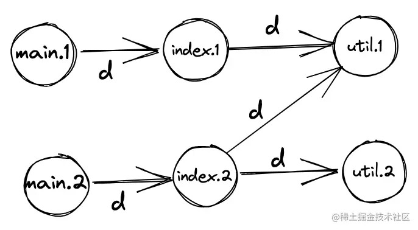

# Webpack 配置项详解

## Entry

告诉 Webpack 配置**模块依赖图**的起点。

Entry 可以接受的值的类型有三种：

1. string
2. string array
3. object

三种类型，构建出来的模块依赖图是完全不一样的。

### Entry 的不同类型值生成的模块依赖图

1. 单页面 单入口

   ```js
   entry: path.resolve(__dirname, '../src/index.1'),
   ```
   

2. 单页面 多入口
 
   ```js
   entry: [
           path.resolve(__dirname, '../src/index.1'),
           path.resolve(__dirname, '../src/index.2')
          ],
   ```
   

3. 多页面
   
   
   

## Optimization 优化

从 webpack 4 开始，会根据你选择的 mode 来执行不同的优化，
不过所有的优化还是可以手动配置和重写。

模块依赖图构建完成以后，
接下来要做的就 **将模块依赖图拆分为多个 bundle**。

这一过程，可以分成 4 个步骤:

1. 对模块依赖图做预处理（`tree shaking`）
2. 初次分离，将模块依赖图分离为 `initial chunk` 和 `async chunks`
3. 二次分离，分离 `common chunks`、`runtime chunk`、`custome chunks`
4. 构建 `bundles`

optimization 提供了很多配置项来指导 Webpack 做更好的完成上面四个步骤。
