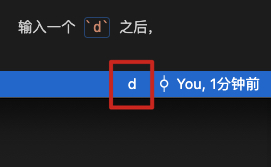

# Vim 

## Day 1
### 两种模式

- mormal 模式（vim 模式）
- insert 模式（文字输入模式）

通过 `i` / `a` 键，可以从 normal 模式切换到 insert 模式。
通过 `esc` 键 / `control` + `[` 键都可以从 insert 模式切换到 normal 模式。

### 移动

- j 下
- k 上
- h 左
- l 右

#### 快速移动

在 normal 模式下，通过长按 jkhl 来快速移动如何设置：

这需要我们进入 VScode Vim 插件的官网，将上面的设置命令依次都在终端里执行一次即可。


### 在终端中如何使用/退出 vim

- 输入 `vim` 即可开始在终端中使用 vim；

在终端中，进入某一目录后，运行 `vim new.txt` 命令，会进入 vim normal 模式，且在没有 new.txt 文件的情况下还会新建一个 new.txt 文件。

在 normal 模式下，
- 输入 `:wq` + enter 即可，表示保存并退出；
- 输入 `:q!` + enter 即可，表示强制退出；

### 切换到 normal 模式下的快捷键更换

有多种方案：

#### 将 control 键更改成 caps lock 键


这样我们按 `control` + `[` 快捷键就会轻松很多。

但其实之后可以用 Karabiner-Elements 一起都改了，就不用再在系统里改了。

#### 在 vscdoe 中的 setting.json 里添加下面的映射

```json
"vim.insertModeKeyBindings": [
    {
        "before": ["n", "n"],
        "after": ["<Esc>"]
    }
]
```
这样通过双击 n 键就可以切换到 normal 模式了。

### 资料

[Chrome 上好用的 Vim 插件](https://microsoftedge.microsoft.com/addons/detail/surfingkeys/kgnghhfkloifoabeaobjkgagcecbnppg)


## Day 2

### 移动到行首和行尾

行首：
1. `0` 可以定位到当前行的行首；
2. `shift` + `6` 即 `^` 可以定位到当前行除 blank 字符的行首； 

行尾：
1. `$` 可以定位到当前行的行尾；
2. `g` + `_` 可以定位到当前行除 blank 字符的行首； 

blank 字符：
1. 空格
2. tab
3. 回车
4. 换行
5. 等

`g` + `_` 和 `^` 这两个命令更加常用，但按起来却很不方便；

所以我们去改一下映射：

```json
"vim.normalModeKeyBindings": [
    {
        "before": ["H"],
        "after": ["^"]
    },
    {
        "before": ["L"],
        "after": ["g", "_"]
    }
]
```

### 插入

1. `I` 在行首插入（包含 blank 字符）；
2. `A` 在行尾插入（包含 blank 字符）；
3. `i` 在光标前插入；
4. `a` 在光标后插入；

1. `O` 在行前插入；
2. `o` 在行后插入；

### 复制粘贴删除

1. `yy` 复制该行；
2. `p` 粘贴；
3. `dd` 删除该行；

vim 的复制粘贴和系统原生的 command c/v 是互相独立，不冲突的。

normal 模式里也可以用 command c/v；

使用 `yy` 和 `p` Vim 是将字符串存到一个寄存器里面，然后再拿出来。
使用 `dd` 之后，被删掉的字符串也将会被保存到寄存器里面，所以在执行 `dd` 之后可以执行 `p` 我们又可以拿回被删掉的那一行。在将某行代码移动位置中很好用。

### Karabiner-Elements 改键

#### 替换 caps_lock 和 control 键


这里操作之后，就不需要去苹果系统里再做修改了，否则反而会失效。

#### control + hjkl 映射成左下上右


### 如何在多个 VScode 窗口中快速切换

`command` + `
## Day 3 - Vim 语法

> Vim 语法 = 操作符 operation + 动作（区域范围）

动作：hjkl o O 等移动都是属于动作。

### 三个操作符

1. 删除符号 `d`
2. 删除并进入 insert 模式 `c`
3. 复制 `y`

输入一个 `d` 之后，会在底部进入一个 pendding 的状态



然后我们再输入动作。比如


## Vim 相关软件使用经验

### Alfred
#### 关闭 Alfred 的 shift 预览

把 中英切换键 更改成 shift 之后，会发现在 Alfred 里面就会经常误触到预览。

Alfred 4 以上的版本可以参照下图取消 shift 预览。


取消后，可以通过 command + y 来预览。