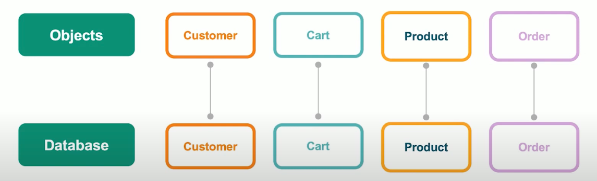

# MongoDB 的特性

## 为什么深受开发者的喜爱

### 1. 简单直接

以自然的方式来建模，以直观的方式来和数据库交互。

- 传统关系型数据库的错综复杂的关系模型：

  

  其实上面的模型已经算是比较简单的了。

- MongoDB 的模型：

  

  我们的各种数据在业务那边是使用对象保存在内存里。
  MongoDB 数据库里也是一样，使用对象模型来保存。

  这让我们数据库模型变得很容易理解，一目了然。

### 2. 结构灵活

MongoDB 能动态添加字段，使其可以快速响应业务的变化。

- **多形性**

  同一个集合可以包含不同类型的文档对象。

- **动态性**

  线上修改数据模式，应用和数据库均无需下线。

  比如给某表里增加或减少字段，这在传统数据库里需要下线，而 MongoDB 里无需下线。

- **数据治理**

  支持使用 JSON Schema 来规范数据模式。

  在保证模式灵活动态的前提下，提供数据治理能力。

  > JSON Schema 是一种声明性的语言，用于描述和验证 JSON 数据结构的格式和内容。
  >
  > JSON Schema 已经成为一个标准，被广泛应用于各种工具和库中，以实现自动化的数据验证。
  >
  > 它提供了一系列的关键词来指定 JSON 文档中数据的规则，包括数据类型、属性是否必须、属性的长度限制、数值的范围限制、对象的属性名和类型、数组中元素的类型等。
  >
  > JSON Schema 本身也是用 JSON 格式编写的，这使得它易于人类阅读和机器解析。

### 3. 快速开发

- **数据库引擎只需要在一个存储区读写**

- **反范式，无关联的组织极大优化查询速度**

- **程序 API 自然，更容易理解**

例如，我们现在要存客户的相关资料。

那在传统关系型数据库中，我们可能需要 customer, address, city, phone, email, interests 等 6 张或更多表来存储相关信息。

但在 MongoDB 里，我们只需要一张 customer 表即可。

这样所有相关信息都被存放在一起。这样做有以下好处：

1. 在很多数据都被存放在机械硬盘的背景下，可以节省其定位数据的时间。

   对于机械硬盘来说，最花费时间的操作是定位数据。

   如果都存在一起，这样就只用定位一次。而传统的需要定位 6 次或更多次。

   MongoDB 在物理机制上，读取很快。

2. 对于开发者也一样，以前要操作 6 张表或更多表，但现在只用操作一张表。

   极大提升开发效率。

## MongoDB 的原生高可用和横向拓展能力

MongoDB 在部署的时候，默认就是使用三个节点的复制集（Replica Set）的部署。

复制集 Replica Set 最少可以是 2 个成员，最多可以是 50 个成员。

最佳实践是至少 3 个以上的奇数节点。

这样做有几个好处：

1. 自动恢复

   如果主节点出现故障，从节点可以马上恢复到主节点。

2. 多中心容灾能力

3. 滚动服务 —— 最小化服务终端

```
Application --> Driver

Driver --> Primary + Secondary (Replication) + Secondary (Replication)
```

## MongoDB 横向拓展能力

- 需要的时候无缝拓展

- 应用全透明

- 多种数据分布策略

- 轻松支持 TB - PB 数量级

MongoDB 的横向拓展是通过**分片集群**来做到的。

分片集群指的是，可以把数据通过水平的方式，拓展到两个，三个，四个 ... 一千个分片上，每一个分片就是一个复制集群。

一个分片如果可以支撑 1TB 的数据，那复制 10 个就是可以多支撑 10 TB。

保证了数据量增加的，访问时间不会有多大影响。

而且 MongoDB 的分布式是全透明的，我们操作的只有一个数据库，但底下其实有很多个。

## MongoDB 的技术优势总结

1. JSON 结构和对象模型接近，开发代码量低

2. JSON 的动态模型意味着更容易响应新的业务需求

3. 复制集提供 99.999% 高可用

4. 分片架构支持海量数据和无缝扩容
