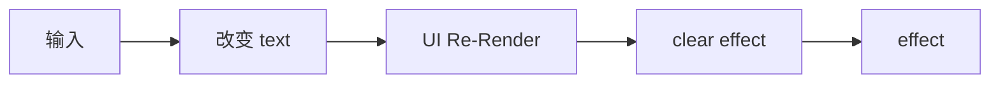

# useEffect

## 概念

`useEffect` 可以让使用者在函数组件中执行副作用操作。

在 React 中，由 `state` 的变化导致 UI 发生变化的过程是正常操作。

其他操作行为：例如数据请求、直接手动修改 DOM 节点、直接操作页面「修改页面标题等」、记录日志等都是副作用操作。

副作用操作是**相对于操作 `state` 而言**的。

每一次因为 `state` 的改变，都有一次对应副作用函数的执行时机。如果 `state` 多次改变，那么就有多次对应副作用的执行时机。


## 清除副作用

effect 和 clear effect 都有可能执行多次。

clear effect 在**下次 effect 执行之前**执行，也会在**组件销毁之前**执行一次。

我们可以借助该特性实现一个防抖的案例：

例如我们要实现一个搜索框的功能。文字输入过程中会自动发起搜索请求。
为了防止请求发送过于频繁，在高频输入时，不发送接口请求，如果超过了 500ms 下一次输入事件还没有发生，那么就自动请求一次。

```tsx
import { useEffect, useState } from "react";

export default function EffectDemo() {
  const [text, setText] = useState("");

  useEffect(() => {
    let timer = setTimeout(() => {
      console.log("发送搜索请求");
    }, 500);

    return () => {
      console.log("清除定时器");
      clearTimeout(timer);
    };
  }, [text]);

  return (
    <div>
      <input
        type="text"
        placeholder="请输入内容..."
        onChange={(e) => setText(e.target.value)}
      />
    </div>
  );
}
```

如果下一次 text 快速发生变化，clear effect 执行会清除掉上一次定义的定时器任务，那么请求逻辑就不会执行。

上面代码的执行顺序是：



> 在真实实践时，我们往往是知道自己要执行的副作用逻辑是什么，
>
> **难的是需要我们自己去设计合理的 `state`**。不合理的设计会让程序变得复杂。

## 闭包

### 如何简化依赖项

当组件函数重新执行时，`useEffect` 函数本身也会重新执行。

`useEffect` 接受的第一个参数 effect 函数是一个匿名函数，它总是会被重新定义。

因此，不管依赖项如何，effect 函数总能访问到最新的 state。

不过 React 会利用闭包来缓存 effect 函数，真正被执行的并非每次重新定义的 effect 函数，而是被缓存起来的 effect 函数。

在初始化和任意依赖项发生变化时，被缓存的 effect 函数会被重新赋值。

理解了上面的内容，我们就有了简化依赖项的前置知识。

我们只需要确保被执行的 effect 函数中总是能访问到正确的值，而不需要添加冗余的依赖项。

## 实战

我们应该尽量避免让引用数据类型成为依赖项。
