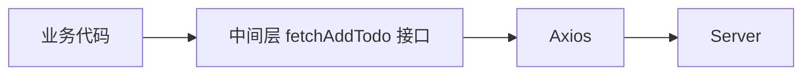

# API 的多种测试方案

通过下面的示例代码来介绍三种测试 API 的主要方式。

```ts
export function fetchAddTodo(title: string) {
  return axios.post("/api/addTodo", { title }).then(({ data }) => {
    return data;
  });
}
```

1. 直接 mock axios
2. mock 中间层
3. 使用 mock server worker

## 分析上述代码

上面代码一共有四层：



1. 最外层是业务代码，

2. 中间层是 `fetchAddTodo` 接口，

3. `fetchAddTodo` 接口使用 Axios 来请求 API，

4. 最里层是，最终浏览器发起的 server 请求。

## 直接 mock axios

直接使用 `mockImplementation` API 将 `axios.post` 整个函数 mock，这样可以将入参也包含在内，更方便测试。

使用 `mockResolveValue` 也可以，但对于入参要另外使用 `toBeCalledWith` API 来进行行为测试。

> `mockResolveValue` 是 `mockImplementation` 的语法糖。

```ts
vi.mock("axios");

test("add todo", () => {
  vi.mocked(axios.post).mockImplementation((path, { title }) => {
    return Promise.resolve({
      data: { data: { id: 1, title } },
    });
  });

  setActivePinia(createPinia());

  const todoStore = useTodoStore();
  const title = "eat";

  await todoStore.addTodo(title);

  expect(todoStore.todo[0].title).toBe(title);
});
```

这样实现方式有一个缺点是，暴露了实现细节（axios）。

如果有一天 axios 被替换成了别的方案，那这些测试也都要跟着替换一遍。

## mock 中间层

```ts
test("add todo", () => {
  vi.mocked(fetchAddTodo).mockImplementation(title) => {
    return Promise.resolve({
      data: { data: { id: 1, title } },
      state: 1,
    });
  });

  setActivePinia(createPinia());

  const todoStore = useTodoStore();
  const title = "eat";

  await todoStore.addTodo(title);

  expect(todoStore.todo[0].title).toBe(title);
});
```

这种方案虽然暴露了 `fetchAddTodo` 接口，但这些接口是很稳定的。

所以 mock 中间层要比 mock axios 方案更好，也是**最推荐的 API 测试方案**。

## 使用 [mock server worker](https://mswjs.io/)

首先 `pnpm i msw -D` 安装依赖。

然后创建一个 mocks 文件夹，在里面新建一个 `server.ts` 文件。

```ts
// server.ts

import { setupServer } from "msw/node";

export const server = setupServer();
```

```ts
import { server } from "../mocks/server";
import { rest } from "msw";

beforeAll(() => {
  server.listen();
});

afterEach(() => {
  server.resetHandlers();
});

afterAll(() => {
  server.close();
});

test("add todo", () => {
  server.use(
    rest.post("http://localhost/api/addTodo", async (req, res, context) => {
      const { title } = await req.json();

      return res(
        context.json({
          data: { data: { id: 1, title } },
          state: 1,
        })
      );
    })

    // 需要 mock 多个 server 的时候
    // rest.post(...)
  );

  setActivePinia(createPinia());

  const todoStore = useTodoStore();
  const title = "eat";

  await todoStore.addTodo(title);

  expect(todoStore.todo[0].title).toBe(title);
});
```

如果我们好几个测试 API 的文件都需要使用 `mws`，那就可以将 `beforeAll`，`afterEach`，`afterEach` 等 `mws` 初始化逻辑抽离出去。

可以配置一个 setup：

```ts
// vitest.setup.ts

console.log("should be called in first");
```

`vitest/config` 是继承自 `vite` 的，所以 `vite` 的配置仍然可以使用。

```ts
// vite.config.ts

import { defineConfig } from "vitest/config";

export default defineConfig({
  test: {
    setupFiles: "./vitest.setup.ts",
  },
});
```
