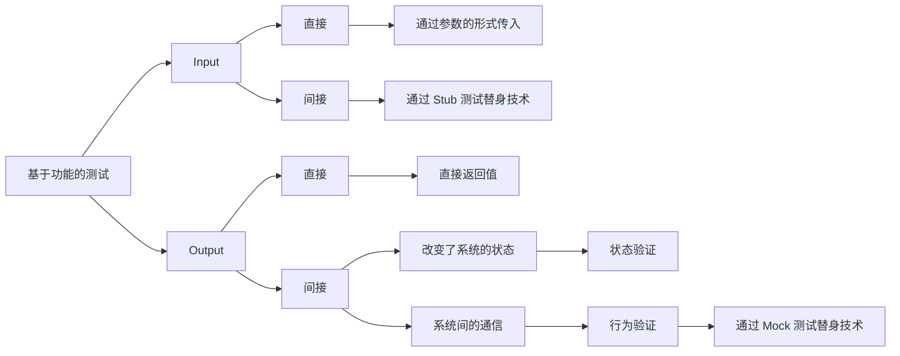

# 测试知识地图

```mermaid
graph LR

A[基于功能的测试] --> B[Input]
B[Input] --> C[直接] --> E[通过参数的形式传入]
B[Input] --> D[间接] --> F[通过 Stub 测试替身技术]

A[基于功能的测试] --> G[Output]
G[Output] --> H[直接]
G[Output] --> J[间接]
H[直接] --> 直接返回值
J[间接] --> I[改变了系统的状态] --> Q[状态验证]
J[间接] --> V[系统间的通信] --> N[行为验证] --> M[通过 Mock 测试替身技术]
```
