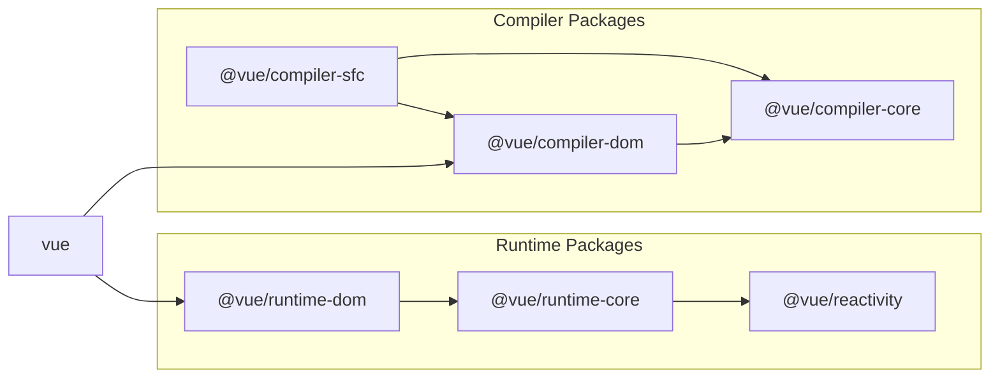

# Vue3 源码介绍

## Vue3 核心模块依赖关系

[Vue3 模块依赖关系](https://github.com/vuejs/core/blob/main/.github/contributing.md#package-dependencies)如下：

我们一般使用的时候，引入最外层的 `vue` 模块就可以。

> 最外层的 `vue` 模块只是一个统一的出口。

在 `vue` 模块的底层分为两个部分，

1. compiler 部分负责处理编译，
2. runtime 部分负责处理运行时。

在 compiler packages 里面，

- `@vue/compiler-sfc` 专门负责解析单文件组件。
- `@vue/compiler-dom` 底层依赖于 `@vue/compiler-core` 模块。
- `@vue/compiler-dom` 和 `@vue/compiler-core` 配合处理单文件组件里的 `template`，将其转译成一个 `render` 函数。

> 在[该网站](https://template-explorer.vuejs.org/#eyJzcmMiOiI8ZGl2PkhlbGxvIFdvcmxkPC9kaXY+Iiwib3B0aW9ucyI6e319)上，你可以看到 `template` 被转换成了何种形式的 `render` 函数。

在 runtime packages 里面，

- `@vue/runtime-dom` 底层依赖于 `@vue/runtime-core` 模块。
- `@vue/runtime-dom` 专门处理 DOM 节点。
- `@vue/runtime-core` 是 Vue 运行时的核心模块。
- `@vue/reactivity` 模块负责实现 Vue 的响应式。

## `@vue/reactivity` 模块的核心逻辑

要理解 Vue 的运行时，就要先理解 `@vue/reactivity` 模块，理解 Vue 是如何收集依赖和触发依赖的。
