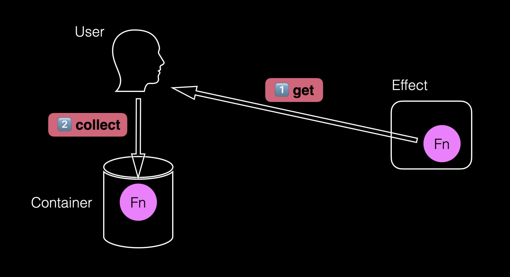
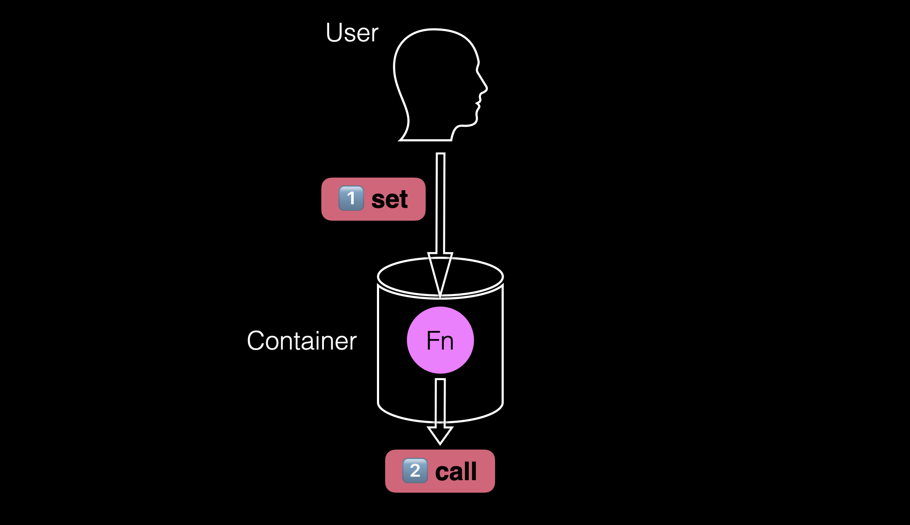

# Happy path of reactivity

```ts
describe('reactivity', () => {
	it('happy path', () => {
		let user = reactivity({name: 'John', age: 23})

		let nextAge
		effect(() => nextAge = user.age + 1)

		// init
		export(nextAge).toBe(11)
		// update
		user.age++
		export(nextAge).toBe(12)
	})
})
```

## Dependencies collection



`user` is **a reactive object**.

Within the reactive object, there is a `container`.
All dependencies of `user` need to be collected in the `container`.

Dependencies are collected using the `effect` function, which takes a `fn` parameter.
The `fn` is called at the beginning of the `effect` function execution.

The code `user.age` in `fn` triggers a `get` operation.

Once the `get` operation is triggered, the reactive object `user` can collect the `fn` into its own `container`.

## Dependencies triggering



When a `set` operation is triggered on `user`, it will invoke all the collected `fn` in its `container`.
