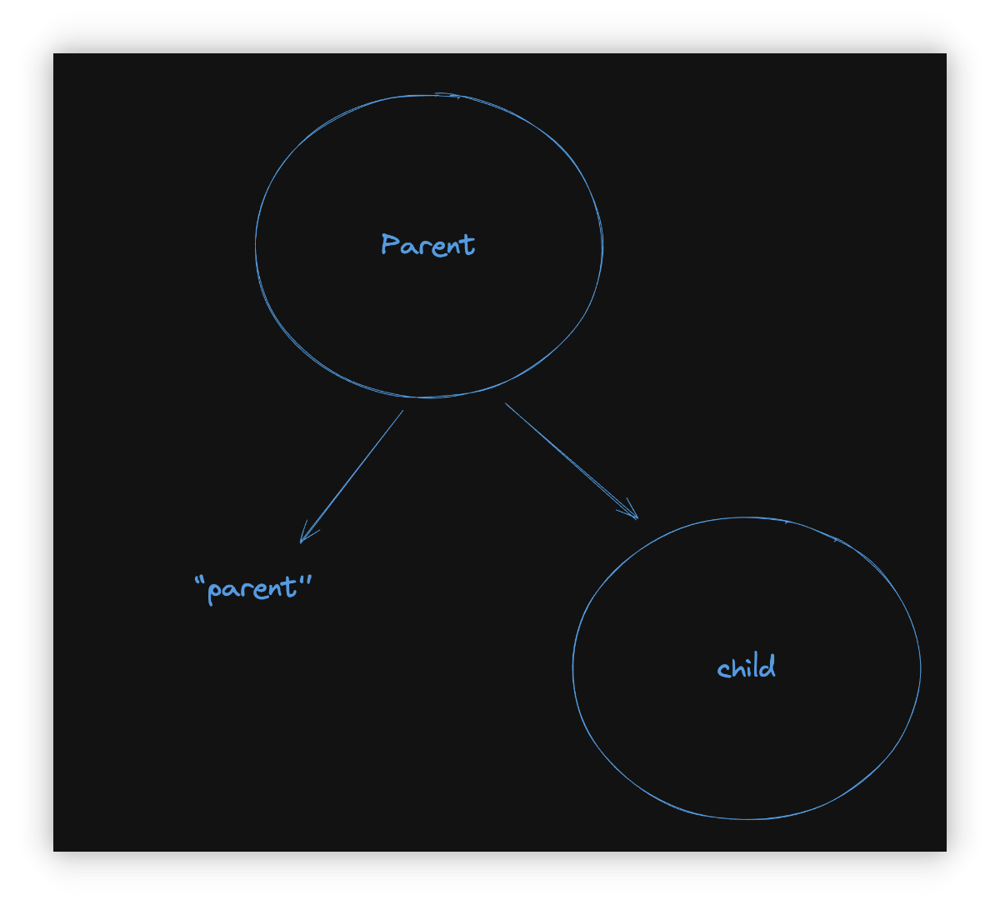
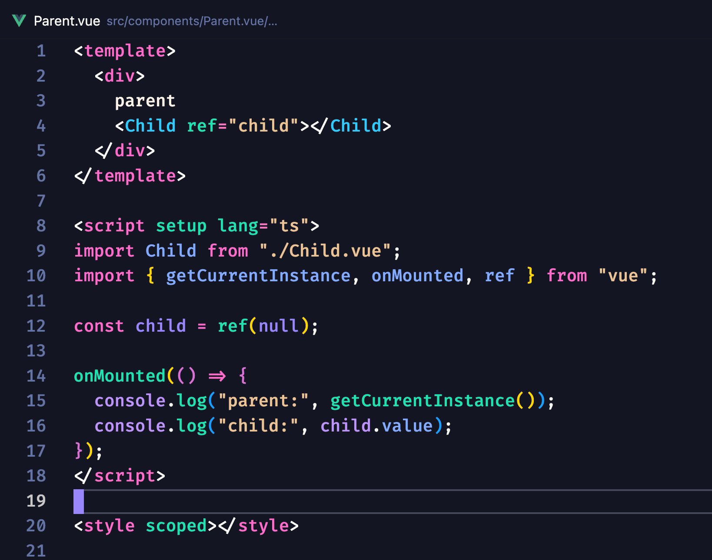
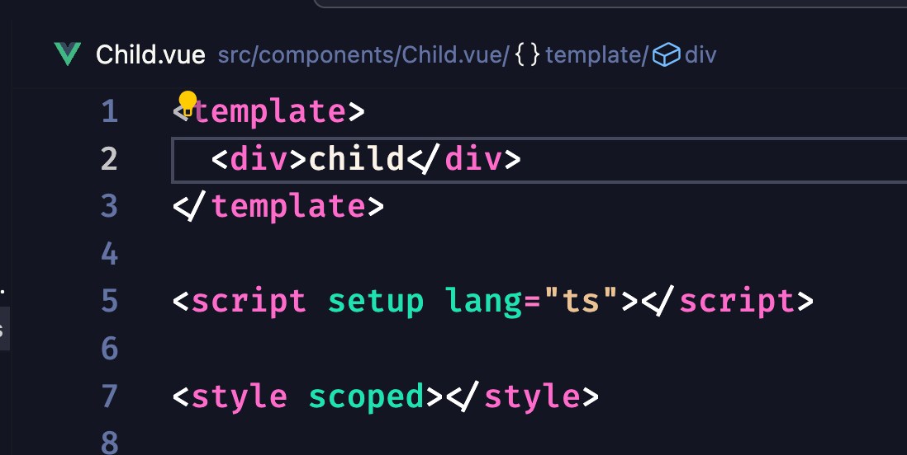

# Vue3 中的 subTree 和 vnode 的区别是什么

## subTree 和 component 的区别是什么

subTree 和 vnode 都是 component 里面的属性。

如果看注释的话：

- subTree： Root vnode of this component's own vdom tree.

- vnode： Vnode representing this component in its parent's vdom tree.

字面意思是：

- subTree 代表的是当前组件的根节点

- vnode 代表的是这个组件在它的父组件的 vdom 树

再来看个图：

我们有这么一个组件树

`Parent` => `"parent"` => `child`

代码是这样：

然后我们打印 `"parent"` 和 `child` 组件的实例对象

先看 `child` 组件的实例对象中的 `subTree` 是长什么样子：

可以看到 type 是 div 而 children 是 “child ”
然后在来回忆下开头对 subTree 的解释 “subTree 代表的是当前组件的根节点”
也就是说这时候的 subTree 对应的是 child 组件中的根节点 div
保险起见 我们把 div 改成 p 试试 subTree 会不会改变

确认了吧？ 现在应该可以理解 subTree 了吧
它代表的就是组件中的 root 元素
接下来我们看 vnode

这里的 type 明显是 component type
然后我们在从 parent 的 vnode 里面查看 child 是如何表示的

可以看到是和 child 的 vnode 是一样的
所以现在我们就能理解 vnode 代表的是什么了吧！ 是组件的虚拟节点
在渲染期间当发现 type 是 component 的话 那么就会进入到该组件的渲染阶段 调用 render 获得内部的虚拟节点(也就是 subTree) ，然后渲染出来
最后在来理解理解这注释：
subTree： Root vnode of this component's own vdom tree vnode： Vnode representing this component in its parent's vdom tree
是不是就明白啦？
